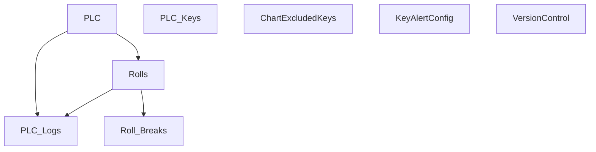

# V 2.1 Dev — V201(postgress_new_plc)

**Line:** PM250 · **Type:** Postgres dev — new PLC integration

## Communication

| Protocol | Interval | Timeout | Role | PLC IP / Host | Port | PLC Data Type | Decode to PLC |
|---|---|---|---|---|---|---|---|
| TCP Server | — | accept 1s | Server | PLC → this host | 2000 | UTF-8 text `key=value;` | recv → strip → split `;` / `=` |
| TCP Client PM3 | 1s | 2s | Client | 172.16.1.171 | 8000 | ASCII request/response | Send payload → recv → parse `n=...;k=v;` |

## Database Structure

## How It Works

Dev sandbox for new PLC integration. Server listens on 2000; client polls `172.16.1.171:8000`. Postgres backend.
