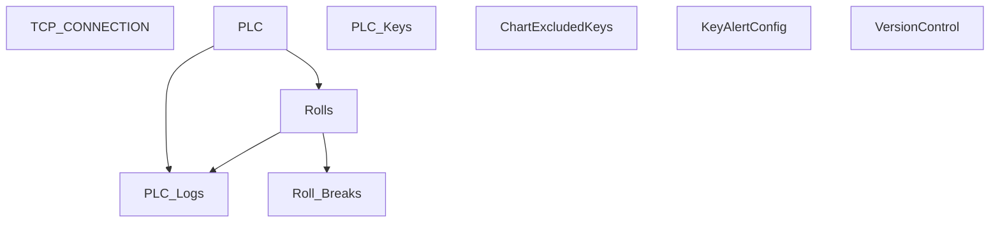

# V 2.1 Release — V201_6015_R

**Web UI port:** `6015` · **Line:** Material Making

## Communication

| Protocol | Interval | Timeout | Role | PLC IP / Host | Port | PLC Data Type | Decode to PLC |
|---|---|---|---|---|---|---|---|
| TCP | — | accept 1s | Server | PLC → this host | 3000 | UTF-8 ASCII | Strip nulls, prefix `n=MAT-MAKING;`, split `key=value;` |

## Database Structure

## How It Works

PLC connects and pushes ASCII telemetry to port 3000. Django stores parsed key/value pairs in `PLC` / `PLC_Logs`. Web dashboard on port **6015**.
