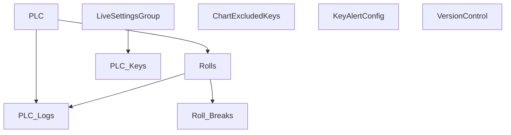

# V 2.2 Dev — V202(postgress_250_main)

**Line:** PM250 · **Type:** Postgres dev sandbox (all protocols)

## Communication

| Protocol | Interval | Timeout | Role | PLC IP / Host | Port | PLC Data Type | Decode to PLC |
|---|---|---|---|---|---|---|---|
| TCP Server | — | accept 1s | Server | PLC → this host | 6009 | UTF-8 text | recv → decode → save PLC_Logs |
| TCP Client PM2 | 2s | 2s | Client | 172.16.1.73 | 8001 | ASCII | Send `t{temp}.0` → parse `key=value;` |
| TCP Client PM3 | 1s | 2s | Client | 172.16.1.40 | 8000 | ASCII | Send `t{temp}.0` → parse `key=value;` |
| TCP Client PM4 | 1s | 2s | Client | 172.16.1.40 | 8000 | ASCII | Same as PM3 (alt script) |
| OPC UA | 10s | — | Client | 172.16.1.175 | 4840 | OPC node values | Read node IDs → `{node: value}` + `n=pm3-main` |

## Database Structure

## How It Works

All PM250 communication prototypes in one dev tree. Run the worker matching your PLC interface.
