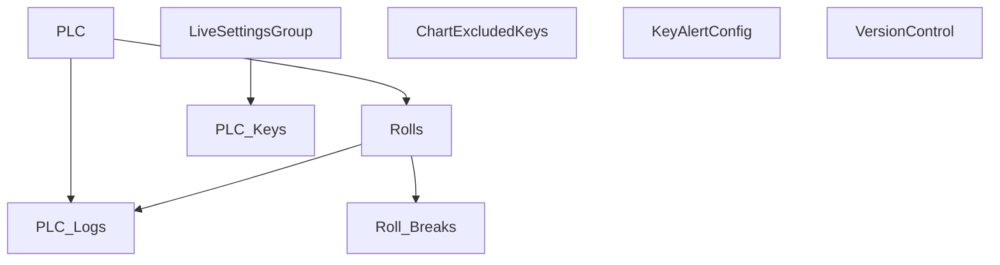

# V 2.3 Release — V203_250_6013_R

**Web UI port:** `6013` · **Line:** PM250 (Paper Machine 3)

## Communication

| Protocol | Interval | Timeout | Role | PLC IP / Host | Port | PLC Data Type | Decode to PLC |
|---|---|---|---|---|---|---|---|
| OPC UA | 10s | — | Client | 172.16.1.175 | 4840 | OPC node values | Read `PLC_Keys.key` as node ID → JSON `{node: value}` + `n=pm3-main` |

## Database Structure

## How It Works

OPC worker polls PLC tags every 10s via `opc.tcp://172.16.1.175:4840`. Rolls/logs tracked from keys `cr`, `ru`, `me1`, `b`. Web on **6013**.
