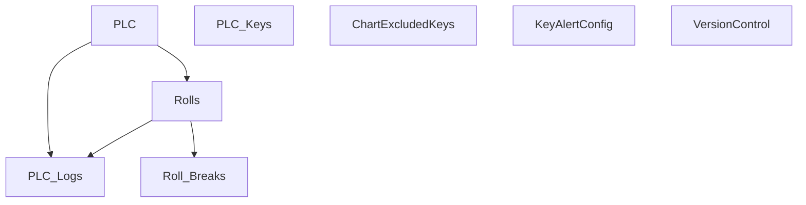

# V 2.4 Release — V204_250_6010_R

**Web UI port:** `6010` · **Line:** PM250 (Paper Machine 3)

## Communication

| Protocol | Interval | Timeout | Role | PLC IP / Host | Port | PLC Data Type | Decode to PLC |
|---|---|---|---|---|---|---|---|
| TCP | 1s | 2s | Client | 172.16.1.40 | 8000 | ASCII `key=value;` | Send `t{temp}.0` → strip nulls → split `;` / `=` |

## Database Structure

## How It Works

TCP client polls PM250 every 1s, sends temperature, parses changed keys into `PLC_Logs`. Web on **6010**.
