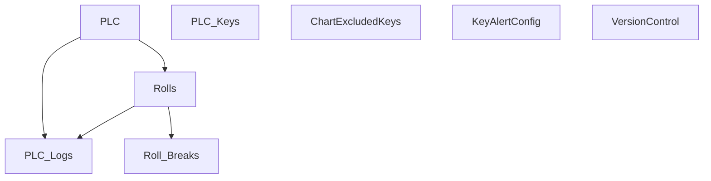

# V 2.5 Release — V205_150_6012_R

**Web UI port:** `6012` · **Line:** PM150 (Paper Machine 2)

## Communication

| Protocol | Interval | Timeout | Role | PLC IP / Host | Port | PLC Data Type | Decode to PLC |
|---|---|---|---|---|---|---|---|
| TCP | — | accept 1s | Server | PLC → this host | 2000 | Binary buffer | `struct.unpack` big-endian by `PLC_Keys.value` dtype at byte offset |

## Database Structure

## How It Works

PLC pushes binary frames to port 2000. Each key defines dtype (int/float/bool/…) and offset for decoding. Web on **6012**.
