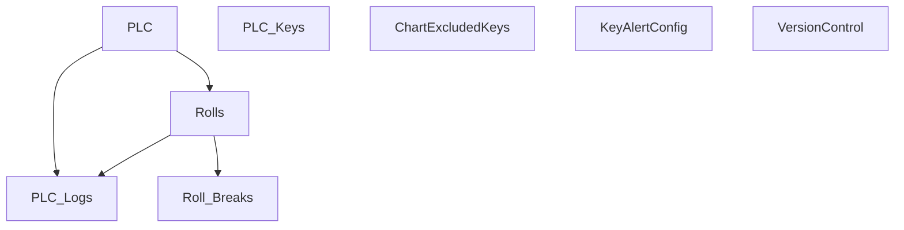

# V 2.5 Release — V205_250_6010

**Web UI port:** `6010` · **Line:** PM250 (Paper Machine 3)

## Communication

| Protocol | Interval | Timeout | Role | PLC IP / Host | Port | PLC Data Type | Decode to PLC |
|---|---|---|---|---|---|---|---|
| TCP | 1s | 2s | Client | 172.16.1.40 | 8000 | ASCII `key=value;` | Send `t{temp}.0` → parse response → log changed keys only |

## Database Structure

## How It Works

PM250 TCP client with roll tracking and auto key registry. Web on **6010**.
