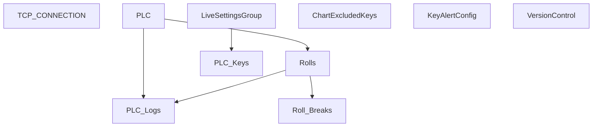

# V 2.5 Release — V205_250_6013_R

**Web UI port:** `6013` · **Line:** PM250 Main (Paper Machine 3)

## Communication

| Protocol | Interval | Timeout | Role | PLC IP / Host | Port | PLC Data Type | Decode to PLC |
|---|---|---|---|---|---|---|---|
| OPC UA | 10s | — | Client | 172.16.1.175 | 4840 | OPC node values | Read nodes → merge PM250 settings from `:6010/api/settings/` |

## Database Structure

## How It Works

OPC worker reads PLC tags and optionally syncs settings from PM250 dashboard (port 6010). Web on **6013**.
