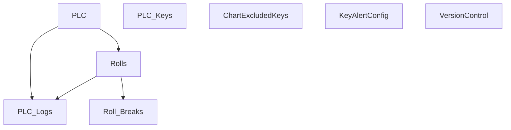

# V 2.6 Release — V206_150_6011_R

**Web UI port:** `6011` · **Line:** PM150 (Paper Machine 2)

## Communication

| Protocol | Interval | Timeout | Role | PLC IP / Host | Port | PLC Data Type | Decode to PLC |
|---|---|---|---|---|---|---|---|
| TCP | 1s | 2s | Client | 172.16.1.73 | 8001 | ASCII `key=value;` | Send `t{temp}.0` from thermal API → parse `;` / `=` response |

## Database Structure

## How It Works

PM150 client sends temperature every 1s, receives process data, stores diffs in DB. Web on **6011**.
