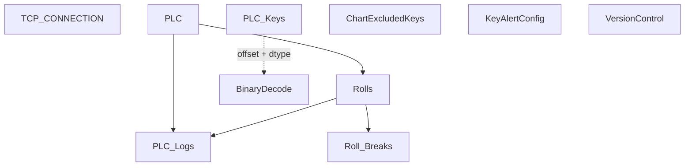

# V 2.6 Release — V206_150_6012_R

**Web UI port:** `6012` · **Line:** PM150 (Paper Machine 2)

## Communication

| Protocol | Interval | Timeout | Role | PLC IP / Host | Port | PLC Data Type | Decode to PLC |
|---|---|---|---|---|---|---|---|
| TCP | — | accept 1s / conn 3s | Server | PLC → this host | 2000 | Binary buffer | `struct.unpack` BE by `PLC_Keys.value` dtype + offset |

## Database Structure

## How It Works

Binary TCP server on port 2000. May fetch PM250 settings via HTTP for cross-line data. Web on **6012**.
