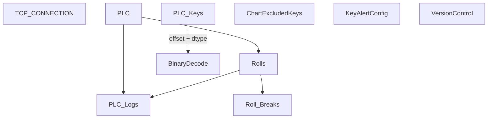

# V 2.7 Release — V207_150_6012_R

**Web UI port:** `6012` · **Line:** PM150 (Paper Machine 2)

## Communication

| Protocol | Interval | Timeout | Role | PLC IP / Host | Port | PLC Data Type | Decode to PLC |
|---|---|---|---|---|---|---|---|
| TCP | — | accept 1s / conn 3s | Server | PLC → this host | 2000 | Binary buffer | `struct.unpack` by dtype + offset from `PLC_Keys` |

## Database Structure

## How It Works

PM150 binary server with PM250 HTTP bridge (`192.168.2.46:6010`). Web on **6012**.
