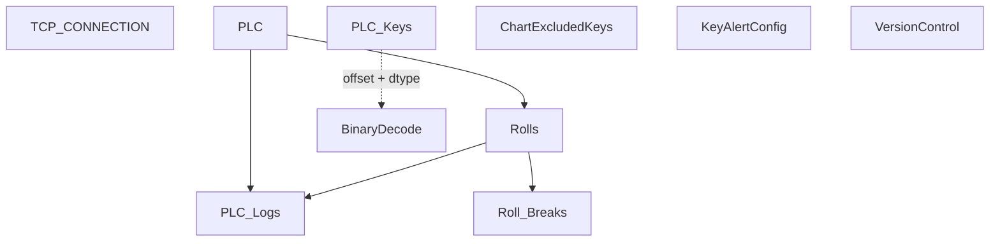

# V 2.8 Release — V208_150_6012_R

**Web UI port:** `6012` · **Line:** PM150 (Paper Machine 2)

## Communication

| Protocol | Interval | Timeout | Role | PLC IP / Host | Port | PLC Data Type | Decode to PLC |
|---|---|---|---|---|---|---|---|
| TCP | — | accept 1s / conn 3s | Server | PLC → this host | 2000 | Binary buffer | `PLC_Keys.offset` + `value`(dtype) → `struct.unpack` BE |

## Database Structure

## How It Works

Latest PM150 binary server with explicit byte offsets on `PLC_Keys`. Web on **6012**.
