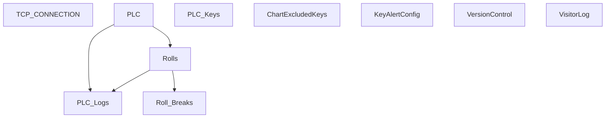

# V 2.8 Release — V208_250_6010_R

**Web UI port:** `6010` · **Line:** PM250 (Paper Machine 3)

## Communication

| Protocol | Interval | Timeout | Role | PLC IP / Host | Port | PLC Data Type | Decode to PLC |
|---|---|---|---|---|---|---|---|
| TCP | 1s | 2s | Client | 172.16.1.40 | 8000 | ASCII `key=value;` | Send `t{temp}.0` (2 sensors) → parse `n=...;k=v;` response |

## Database Structure

## How It Works

Latest PM250 client. Dual thermal sensors, log optimization command, visitor logging. Web on **6010**.
